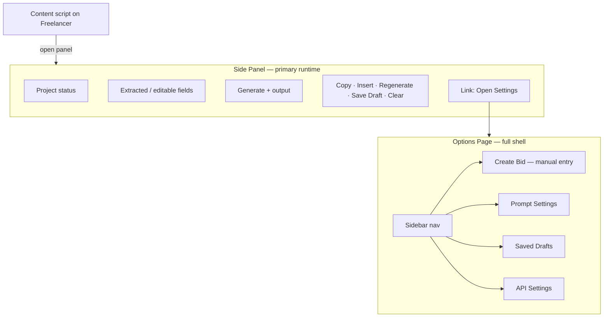

# ADR: UI Scope for v1

**Status:** Accepted  
**Date:** 2026-07-03  
**Context:** [`docs/idea/idea.md`](../idea/idea.md) defines a side-panel-first workflow; [`docs/ui-vision/`](../ui-vision/) mockups depict a wider multi-page app (Dashboard, Dev Guide, etc.). Implementation must reconcile these before building.

---

## Decision

**v1 uses a hybrid layout — not side-panel-only, not the full mockup shell.**

| Surface | Role in v1 | Layout |
|---------|------------|--------|
| **Chrome side panel** | Primary bid workflow while browsing Freelancer.com | Compact, single-column, no sidebar |
| **Chrome options page** | Settings, drafts, and manual bid entry | Full-width app shell with sidebar nav (from mockups) |

The side panel and options page share one React component library and design tokens (dark navy, electric blue accent). They differ only in layout wrapper and which routes/screens are mounted.

---

## Rationale

### Why not side-panel-only for v1?

- [`idea.md`](../idea/idea.md) requires a **settings area** (API URL, prompt rules, sign-off, company, services, words to avoid, defaults) and **saved drafts** — too many fields for a narrow (~400px) side panel used during active bidding.
- Prompt Settings and API Settings mockups are form-heavy; cramming them into the side panel would hurt the core “generate proposal fast” flow.
- Manual **Create Bid** (when DOM extraction fails) needs the same form as the side panel but with more room; the options page is the natural home.

### Why not the full mockup shell in v1?

- **Dashboard** (stats, recent bids, avg length) is analytics over local history — valuable but not required for the core safety-bounded workflow in `idea.md`.
- **Dev Guide** duplicates setup docs that belong in `README.md`; a dedicated in-extension page is polish, not MVP.
- **API Settings** mockup shows Gemini model and temperature — those are **backend env vars** (`GEMINI_API_KEY`, model config), not extension client settings. Exposing them in the UI would mislead users and violate the “key only on backend” rule.
- Shipping Dashboard + Dev Guide before the bid loop works adds surface area without improving day-one utility.

### Why hybrid works

- Matches how users actually work: generate on Freelancer (side panel) → configure occasionally (options page).
- Chrome MV3 supports both `side_panel` and `options_page` natively; no extra permissions.
- Mockup sidebar nav fits the options page; side panel stays focused on Create Bid + output actions.

---

## v1 screen map

### Side panel (v1 — in scope)

All items from `idea.md` § side panel:

- App title + project detected / not detected status
- Editable extracted fields (title, description, budget, skills, client country, project type)
- Extra instructions, style dropdown, length dropdown
- Generate Proposal → loading → output
- Copy, Insert Into Bid Box, Regenerate, Save Draft, Clear
- Insert confirmation toast: *“Proposal inserted. Please review and submit manually.”*
- Footer link/icon to open options page (settings)

**Not in side panel v1:** sidebar nav, dashboard stats, dev guide, API model/temperature controls.

### Options page (v1 — in scope)

| Nav item (mockup) | v1 | Notes |
|-------------------|----|-------|
| **Create Bid** | Yes | Same form as side panel; for manual entry when not on a project page or extraction fails |
| **Prompt Settings** | Yes | Sign-off, company, services, default style/length, default closing line, words to avoid, custom proposal rules (merge mockup + `idea.md` fields) |
| **Saved Drafts** | Yes | List/load/delete drafts from `chrome.storage.local` (supports side panel “Save Draft”) |
| **API Settings** | Yes (minimal) | Backend URL + Test Connection (`GET /api/health`); **no** model or temperature UI |
| **Dashboard** | **Deferred v2** | Stats require bid-history tracking not specified in core spec |
| **Dev Guide** | **Deferred v2** | v1: sidebar footer link to repo `README.md` / setup section only |

Options page uses the mockup shell: left sidebar, logo, nav items above, version badge footer (`v1.0.0 · Manifest V3 · No auto-submit`).

---

## Deferred to v2+ (from mockups)

| Feature | Reason to defer |
|---------|-----------------|
| Dashboard (total bids, avg length, recent bids) | Requires local analytics schema and UI polish; optional per plan Phase 3 |
| Dev Guide (in-extension page) | Content lives in README; inline page is documentation duplication |
| Gemini model / temperature in UI | Backend-only configuration |
| “Extension Preview” toggle on Create Bid | Dev convenience; side panel IS the preview in production |

---

## Technical implications

1. **Monorepo / extension structure**
   - `extension/src/side-panel/` — compact layout entry
   - `extension/src/options/` — full shell entry with React Router (or equivalent)
   - `extension/src/components/` — shared: form fields, proposal output, style/length selects, toasts
   - `extension/src/layouts/` — `app-shell-layout`

2. **Routing**
   - Side panel: single view (no client router needed); optional hash for settings deep-link from options
   - Options page: `/create`, `/prompt-settings`, `/drafts`, `/api-settings` (Dashboard route stub optional, hidden or omitted)

3. **Storage**
   - Same `chrome.storage.local` keys read/written from both surfaces
   - Changing Prompt Settings on options page applies to next Generate in side panel

4. **Messaging**
   - Content script → service worker → `sidePanel.open()` unchanged
   - Options page “Create Bid” does not require content script; Insert Into Bid Box hidden or disabled when no Freelancer tab active

5. **Design**
   - Side panel: stacked cards, full-width CTAs, collapsible sections if needed; target min width ~360px
   - Options page: mockup sidebar + main content; reuse same tokens and components

---

## Acceptance criteria (this decision is “done” when)

- [x] v1 scope explicitly lists side panel vs options page responsibilities
- [x] Dashboard and Dev Guide marked deferred with rationale
- [x] API Settings scope clarified (URL + health check only)
- [x] Shared component strategy documented for implementers

---

## References

- Product spec: [`docs/idea/idea.md`](../idea/idea.md)
- UI mockups: [`docs/ui-vision/`](../ui-vision/)
- Plan gap analysis: side panel vs full app (see plan doc, not edited here)
